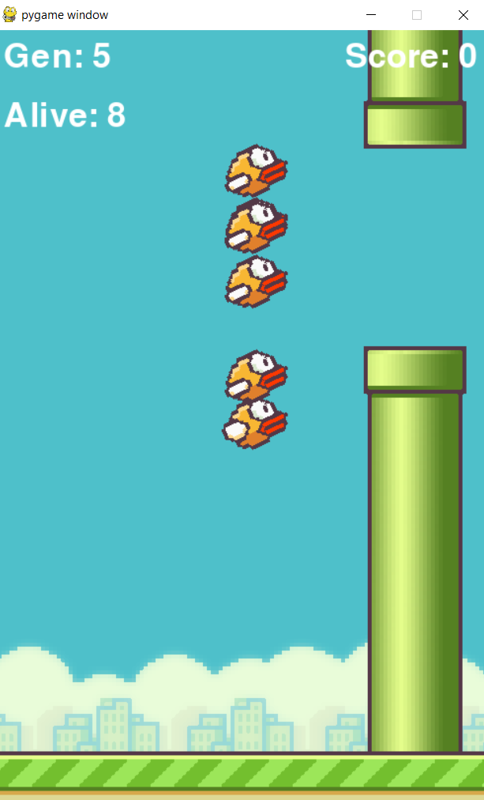
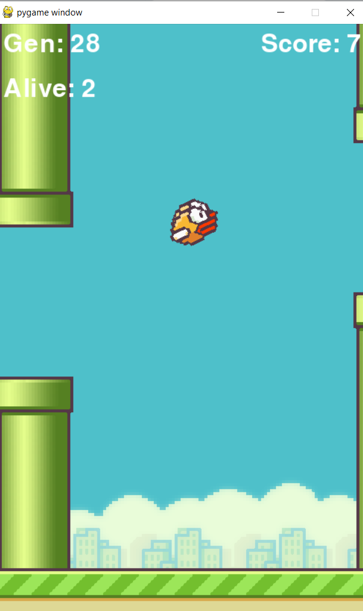

The game flappy bird was built using the python library pygame.
An agent was trained to play the game with the Neuro Evolution of Augmenting Topologies (NEAT) technique. Each generation had a population of 20 agents who were given the
y co-ordinate of the agent, vertical and horizontal distances between the pipes as the input and the probability of jumping  was obtained as the output.The agents excelled and
reached high scores by 30 generations.

